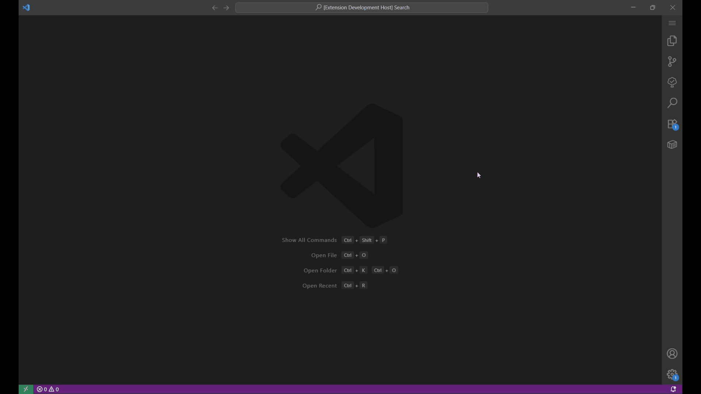

# GDXViewer
This extension renders the GAMS GDX file in VSCode Webview. It executes a Python script in the background using Node's `child_process`. The python interperter, which contains the `gams` library, must be set before using the extension. 

## Features
Once the Python interpreter's path is set, you can either provide the path to the GDX file or, if the file is already available in the workspace, right-click to bring up the context menu and select "GDX: Display the .gdx file.

1. Select a symbol from the sidebar to display its content.
2. Search for a symbol in the GDX file.
3. Since `GDXViewer` parses JSON string to display the content, values like `Infinity` and `-Infinity` has been replaced with `1e+300` and `1e-300`.

## Requirements

The python script that reads the data from the GDX file requires that gams\[transfer] is installed in the provided Python interpreter.

## Extension Settings

This extension contributes the following settings:

* `gdx.Display`: Display the GDX File.

## Release Notes

### 1.1.0

- Replaced `execFile` with `spawn`, eliminating `maxBuffer` limitations; large GDX files can now be viewed.
- Fetch symbol data on request
- File picker dialog box for selecting the GDX File
- Support for VSCode light themes

### 1.0.1

- Updated README

### 1.0.0

- Initial release of `GDXViewer`.
