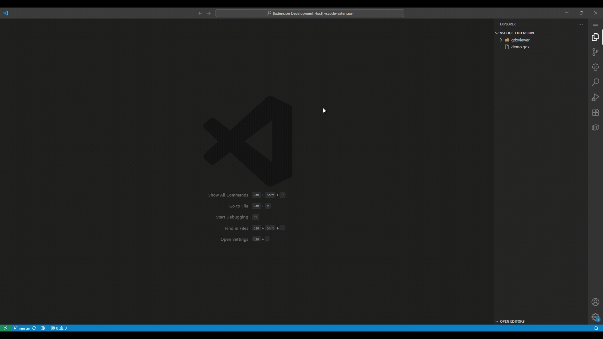

# GDXViewer
This extension renders the GAMS GDX file in VSCode Webview. It executes a Python script in the background using Node's `child_process`. The python interperter, which contains the `gams` library, must be set before using the extension.

If the required environment is not available, the extension [provides a command](#extension-settings) to generate a Dev Container [configuration file](./.devcontainer/devcontainer.json) and prompts the user to reopen VS Code in a containerized environment with all necessary dependencies. This feature is especially useful when working in remote VS Code instances, such as GitHub Codespaces.

## Features
Once the Python interpreter's path is set, you can either provide the path to the GDX file or, if the file is already available in the workspace, right-click to bring up the context menu and via the `Open with...` option select "GDX Viewer" as the default editor.

1. Select a symbol from the sidebar to display its content.
2. Search for a symbol in the GDX file.
3. Since `GDXViewer` parses JSON string to display the content, values like `Infinity` and `-Infinity` has been replaced with `1e+300` and `1e-300`.



## Requirements

The Python script for reading data from a GDX file requires the [gamsapi\[transfer\]](https://pypi.org/project/gamsapi/) package to be installed in the specified Python interpreter, along with either the `gams` executable available on the system path or the `gamspy_base` package installed in the same interpreter.

There is a [requirements.txt](./requirements.txt) file that contains the required packages which can be installed via,

```bash
pip install -r requirements.txt
```

## Extension Settings

This extension contributes the following settings:

* `gdx.Display`: Display the GDX File.
* `gdx.initializeDevContainer`: Creates the Recommended `devcontainer.json` file.

## Release Notes

### 1.2.1

- Fixed `postCreateCommand` to not pipe the output.

### 1.2.0

- Added support for Remote VS Code instance
- Added `CustomEditor` for better UX.
- Selecting the gdx file now directly opens the view, if `GDX Viewer` is set as the default editor.

### 1.1.1

- Refactor javascript and css into distinct files for maintainability

### 1.1.0

- Replaced `execFile` with `spawn`, eliminating `maxBuffer` limitations; large GDX files can now be viewed.
- Fetch symbol data on request
- File picker dialog box for selecting the GDX File
- Support for VSCode light themes

### 1.0.1

- Updated README
